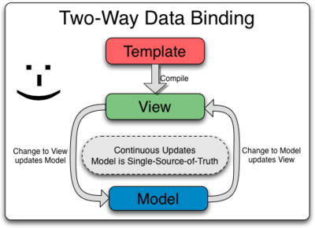
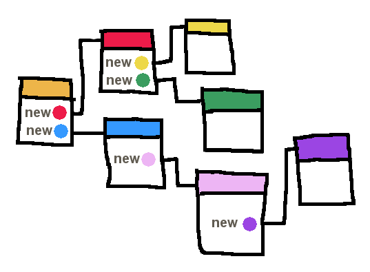
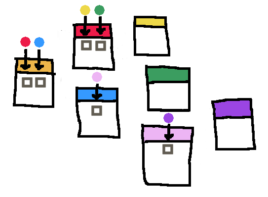

# Angular

<!-- slide-front-matter class: center, middle -->

## Summary

Get started with and understand the basics of [Angular][angular], a JavaScript front-end web application framework.

This tutorial is a condensed version of Angular's [Tour of Heroes][angular-tour-of-heroes] tutorial and some of its [Developer Guide][angular-guide],
which you should both read to gain a deeper understanding of Angular.

<!-- slide-include ../../BANNER.md -->

**You will need**

- [Edge][edge] or [Google Chrome][chrome] (recommended, any browser with developer tools will do)
- [Visual Studio Code][vscode] (recommended, although any editor could do)

**Recommended reading**

- [JavaScript][js]
- [JavaScript classes][js-classes]
- [JavaScript modules][js-modules]
- [TypeScript][ts-subject]

<!-- START doctoc generated TOC please keep comment here to allow auto update -->
<!-- DON'T EDIT THIS SECTION, INSTEAD RE-RUN doctoc TO UPDATE -->

- [What is Angular?](#what-is-angular)
- [Getting started](#getting-started)
  - [Starter template](#starter-template)
  - [Overview](#overview)
  - [Modules](#modules)
    - [Basic module definition](#basic-module-definition)
  - [Components](#components)
    - [Component selector](#component-selector)
    - [Component template](#component-template)
    - [Component styles](#component-styles)
  - [Data binding](#data-binding)
    - [Attribute binding](#attribute-binding)
      - [To bind, or not to bind](#to-bind-or-not-to-bind)
      - [When to use which?](#when-to-use-which)
    - [Binding to events](#binding-to-events)
      - [Getting at the event](#getting-at-the-event)
    - [Interpolation with functions](#interpolation-with-functions)
- [User input](#user-input)
  - [`ngModel`](#ngmodel)
    - [`FormsModule`](#formsmodule)
  - [Two-way data binding](#two-way-data-binding)
- [Directives](#directives)
  - [Structural directives](#structural-directives)
  - [Attribute directives](#attribute-directives)
    - [Define and bind the classes](#define-and-bind-the-classes)
  - [Common directives](#common-directives)
- [Pipes](#pipes)
  - [Use case](#use-case)
  - [Using a pipe](#using-a-pipe)
  - [Angular built-in pipes](#angular-built-in-pipes)
- [Models](#models)
  - [Using models](#using-models)
  - [Using `ngFor`](#using-ngfor)
  - [Using `ngPlural`](#using-ngplural)
- [Services](#services)
  - [The joke service](#the-joke-service)
  - [Providing the joke service](#providing-the-joke-service)
  - [Injecting the joke service](#injecting-the-joke-service)
    - [Calling a method from a button](#calling-a-method-from-a-button)
  - [Why does it work?](#why-does-it-work)
  - [Dependency injection](#dependency-injection)
    - [Why dependency injection?](#why-dependency-injection)
- [Observable data](#observable-data)
  - [Making `getJoke()` observable](#making-getjoke-observable)
  - [Subscribing to an Observable](#subscribing-to-an-observable)
- [Making HTTP calls](#making-http-calls)
  - [Injecting `HttpClient`](#injecting-httpclient)
  - [Joke API response](#joke-api-response)
    - [Joke API response model](#joke-api-response-model)
  - [Making a GET call](#making-a-get-call)
  - [Transforming data](#transforming-data)
  - [Transforming Observable streams](#transforming-observable-streams)
  - [Reacting to errors in observable streams](#reacting-to-errors-in-observable-streams)
- [Component interaction](#component-interaction)
  - [Adding votes to the model](#adding-votes-to-the-model)
  - [Creating a component](#creating-a-component)
    - [The `JokeComponent`](#the-jokecomponent)
  - [Using our new component](#using-our-new-component)
  - [Passing data from parent to child with input binding](#passing-data-from-parent-to-child-with-input-binding)
  - [Voting on jokes](#voting-on-jokes)
  - [Displaying global voting information](#displaying-global-voting-information)
  - [Output from child components](#output-from-child-components)
  - [Listening to child component events from a parent](#listening-to-child-component-events-from-a-parent)
  - [Clearing the votes](#clearing-the-votes)
  - [More component interaction](#more-component-interaction)
- [Resources](#resources)

<!-- END doctoc generated TOC please keep comment here to allow auto update -->

## What is Angular?

<!-- slide-front-matter class: center, middle, image-header -->

<p class='center'></p>

> "Angular is a complete **JavaScript front-end web application framework** created by Google to address many of the challenges of developing **rich single-page applications**."

## Getting started

<!-- slide-front-matter class: center, middle -->

### Starter template

If you want to follow along this tutorial, you can generate a new barebone angular application.

To do so, in the directory where you want to generate the application folder, execute the following script:

```bash
$> npx @angular/cli new angular-starter
# If asked, accept to install the package
? Would you like to add Angular routing? `No`
? Which stylesheet format would you like to use? `SCSS`
```

> If you'd prefer to install the Angular CLI globally, see [the related subject][angular-cli]

Wait for the generator to end (this may take several minutes), then go to the newly created folder and start the development server:

```bash
$> cd angular-starter
$> npm start
```

When the CLI tells you so, go to [`http://localhost:4200`](http://localhost:4200). Don't forget to keep your [developer console][chrome-dev] open throughout this tutorial to detect errors in your code.

### Overview

<!-- slide-column -->

**Angular elements**

- Modules
- Components
- Directives
- Services
- HTTP
- Pipes

<!-- slide-column -->

**Angular concepts**

- Interpolation
- Data binding
- Dependency injection
- Observables & reactive programming
- Form validation

### Modules

An Angular application is a **module**.
You can find one in `src/app/app.module.ts` in the starter project:

```ts
import { NgModule } from '@angular/core';
import { BrowserModule } from '@angular/platform-browser';

import { AppComponent } from './app.component';

`@NgModule`({
  declarations: [
    AppComponent
  ],
  imports: [
    BrowserModule
  ],
  providers: [],
  bootstrap: [AppComponent]
})
export `class AppModule` { }
```

A module is a way to help organize related things (components, services, etc) together.

> **Angular CLI**: Use `ng generate module <ModuleName>` to create a new module and its new directory

#### Basic module definition

Take a look at the [`@NgModule`][angular-docs-ng-module] annotation:

```ts
@NgModule({
  `declarations`: [
    AppComponent
  ],
  `imports`: [
    BrowserModule
  ],
  `providers`: [],
  `bootstrap`: [AppComponent]
})
```

- The **declarations** array is a list of components, directives and/or pipes that this module contains.
- The **imports** array is a list of other modules required by this module. It allows you to express a dependency on another module.
- The **providers** array is a list of service providers (more about that later).
- **bootstrap** is the root component that Angular creates and inserts into `index.html`

### Components

Components are the most basic **building block** of an UI in an Angular application.
An Angular application is a tree of Angular components.

You will find a component in `src/app/app.component.ts` in the starter project:

```ts
import { Component } from '@angular/core';

`@Component`({
  selector: 'app-root',
  templateUrl: './app.component.html',
  styleUrls: ['./app.component.css']
})
export `class AppComponent` {
  title = 'angular-starter';
}
```

A component is primarily a [JavaScript class][js-classes] annotated with the [`@Component`][angular-docs-component] decorator.

Let's dig into that line by line.

> **Angular CLI**: Use `ng generate component <ComponentName>` to create all the files for a new component in a new directory

#### Component selector

The `selector` property of the `@Component` decorator indicates what tag you should put in your HTML to instantiate the component:

```ts
@Component({
  `selector: 'app-root'`,
  templateUrl: './app.component.html',
  styleUrls: ['./app.component.css']
})
```

Open `src/index.html` in the starter project.
You will find the `<app-root>` tag:

```html
<body>
  `<app-root></app-root>`
&lt;/body&gt;
```

#### Component template

The `templateUrl` property of the `@Component` decorator tells Angular which HTML file to use as this component's template:

> This template file defines the structure of the component when displayed on the page

```ts
@Component({
  selector: 'app-root',
  `templateUrl: './app.component.html'`,
  styleUrls: ['./app.component.css']
})
```

For very simple components, you can also use `template` instead of `templateUrl` to use an **inline template**:

```ts
@Component({
  selector: 'app-root',
  `template: '<h1>Welcome to {{ title }}!</h1>'`,
  styleUrls: ['./app.component.css']
})
```

#### Component styles

Similarly, the `styleUrls` property is a list of CSS files to apply to the component :

```ts
@Component({
  selector: 'app-root',
  templateUrl: './app.component.html',
  `styleUrls: ['./app.component.css']`
})
```

It's also possible to use **inline styles** for very simple components:

```ts
@Component({
  selector: 'app-root',
  templateUrl: './app.component.html',
  `styles: [ 'h1 { font-weight: normal;  }' ]`
})
```

> Styles in Angular are **scoped to the component**. They apply **only to its template**.

Read the [Component Styles][angular-component-styles] documentation to learn more.

### Data binding

You can display data by **binding** parts of an HTML template to properties of the associated component.

There is already a `title` property on `AppComponent` in `src/app/app.component.ts`:

```ts
export class AppComponent {
  title = "angular-starter";
}
```

Enclosing a component's property name in double curly braces in the template is called **interpolation**.

You can do so in the `AppComponent`'s template in `src/app/app.component.html` by removing **all** the biolerplate content and pasting the following code:

```html
<h1>Welcome to `{{ title }}`!</h1>
```

#### Attribute binding

Let's see what else we can interpolate.

Let's rewrite the `AppComponent`'s class definition and add a new `titleComment` property to the component in `src/app/app.component.ts`:

```ts
export class AppComponent {
  title: string;
  `titleComment: string;`

  constructor() {
    this.title = 'angular-starter';
    `this.titleComment = 'This is awesome!';`
  }
}
```

Angular's bracket syntax (`[...]`) allows you to bind the value of a DOM element's **attribute** to one of the component's variables.

You can do this in `src/app/app.component.html`:

```html
<h1 `[title]="titleComment"`>Welcome to {{ title }}!</h1>
```

##### To bind, or not to bind

Note the two syntax when binding to attributes.

Below, as in the previous example, the `[...]` syntax **binds the the `title` attribute** to the `titleComment` variable:

```html
<h1 `[title]="titleComment" `>Welcome to {{ title }}!</h1>
```

Below, the `title` attribute itself is not bound, but its **value is interpolated** with the `{{ ... }}` syntax.
The result will effectively be the same as the previous example:

```html
<h1 title="`{{ titleComment }}`">Welcome to {{ title }}!</h1>
```

> Here, we made a **mistake**.
> We neither bound the attribute, nor used interpolation in its value,
> so the value of the attribute will be the string `"titleComment"`,
> not the value of the corresponding variable:
  ```html
  <h1 title="titleComment">Welcome to {{ title }}!</h1>
  ```

##### When to use which?

Since the bracket syntax (`[...]`) and the curly braces syntax (`{{...}}`) have apparently **the same result**,
why and when should you use one over the other?

Basically, if you want to use a component's property **as the exact value** of an element attribute, you use brackets:

```html
<h1 [title]="titleComment">...</h1>
```
> The **actual value** of `title` will always be **exactly** the value of `titleComment` and will have the **same type**.

If you want to use a component's property **as part of the value** of an element attribute, you use curly braces:

```html
<h1 title="Custom Title: {{ titleComment }}">...</h1>
```
> The **actual value** of `title` will always be "Custom Title:" plus **the string representation** of `titleComment`'s value.

#### Binding to events

Let's imagine that we want to log something when the user clicks on the title.
Add an `onTitleClicked()` method to the component's class in `src/app/app.component.ts`:

```ts
export class AppComponent {
  // ...

* onTitleClicked() {
*   console.log('The title was clicked');
* }
}
```

Angular's `(...)` syntax allows you to **bind functions to events** occurring on a DOM element.

Let's bind the function we just created to `click` events on the `<h1>` tag in `src/app/app.component.html`:

```html
<h1 [title]="titleComment" `(click)="onTitleClicked()" `>
  Welcome to {{ title }}!
</h1>
```

You should now see the message being logged in the console when clicking on the title.

##### Getting at the event

You might need the actual [event object][dom-event] to get some data out of it (for example, the click coordinates).

Let's update `onTitleClicked()` in `src/app/app.component.ts` to accept an event parameter and log it:

```ts
export class AppComponent {
  // ...

  onTitleClicked(`event: MouseEvent`) {
    console.log('The title was clicked'`, event`);
  }
}
```

To make this work, pass the special `$event` value as an argument to your function call in `src/app/app.component.html`, and Angular will pass the event object to your function:

```html
<h1 [title]="titleComment" (click)="onTitleClicked(`$event`)">
  Welcome to {{ title }}!
</h1>
```
> Note that you **must** use exactly `$event` as the argument's value

#### Interpolation with functions

Interpolation is not limited to simple properties.
You can also use a component's **method** in the template.

Add the following method to the component in `src/app/app.component.ts`:

```ts
export class AppComponent {
  // ...

* hello(name: string): string {
*   return \`Hello ${name}`;
* }
}
```

Now use that function in the template in `src/app/app.component.html`:

```html
<!-- Add this to the end of the file -->
<p>`{{ hello("World") }}`</p>
```

> Change the value passsed to the `hello()` function to see it change.

## User input

One of the things you will need to do is **react to user input** (for example, through forms).

Let's make our greeting **dynamic** by adding an input field to customize the name.
Make the following changes to the component in `src/app/app.component.ts`:

```ts
export class AppComponent {
  // ...
  `greeting: string;`

  constructor() {
    this.title = 'app';
    `this.greeting = '';`
  }
  // ...
}
```

Now interpolate that new property into the `hello` function in the template in `src/app/app.component.html`:

```html
<p>{{ hello(`greeting`) }}</p>
```

### `ngModel`

Add an input field to the template above the greeting in `src/app/app.component.html`:

```html
*<p>
* <input type="text" placeholder="Who are you?" [(ngModel)]="greeting" />
*</p>
<p>{{ hello(greeting) }}</p>
```

`[(ngModel)]` is Angular's **two-way data binding** syntax.
It binds the `greeting` property to the HTML input field, and _vice-versa_.

You will most likely get this error in the console:

```
Uncaught Error: Template parse errors:
Can't bind to 'ngModel' since it isn't a known property of 'input'.
```

This is because `[(ngModel)]` is provided by the optional `FormsModule`, which you have to _opt in_ to use.

#### `FormsModule`

To **import** the module into your application, you must add it to the `imports` array of your own module in `src/app/app.module.ts`:

```ts
// Other imports...
*import { FormsModule } from '@angular/forms';

@NgModule({
  declarations: [
    AppComponent
  ],
  imports: [
    BrowserModule,
    `FormsModule`
  ],
  providers: [],
  bootstrap: [AppComponent]
})
export class AppModule { }
```

Once you've done that, the error should be gone and everything should display as expected.

Now, as you type inside the input field, the `greeting` variable is **automatically kept up-to-date** in the background,
and Angular **updates the template** to reflect the new value.

### Two-way data binding

<!-- slide-column -->

Traditional templating systems bind data **in only one direction**.

The developer has to write code that constantly syncs the view with the model and vice versa.


<!-- slide-column -->

With Angular, changes are **immediately reflected** in both view and model.

Also note that our **component** is **isolated from and unaware of the view**:
it does not care about DOM manipulation or rendering concerns.



## Directives

Just as **Components** can be seen as **custom HTML tags** that display and behave as defined by their template and class,
**Directives** can be seen as **custom HTML attributes** that can be added to HTML elements (or Angular components) to apply them various effects.

> Technically, a **Directive** is a class decorated with the `@Directive` decorator.

Directives in Angular can be divided into two categories: **structural** and **attribute** directives.

### Structural directives

Structural directives have an impact on the HTML layout.

They shape or reshape the **DOM's structure**, typically by **adding, removing, or manipulating elements**.

Let's add the [`ngIf`][angular-docs-ng-if] directive to our template in `src/app/app.component.html` as an example:

```html
<p `*ngIf="greeting" `>{{ hello(greeting) }}</p>
```

> The `*` before `ngIf` in the template is not a typo ; structural directives must **always** be preceeded by a `*`.

As you can see, the entire paragraph is now removed from the DOM as long as the `greeting` property is _falsy_ (e.g. `undefined` or an empty string).

It is added back to the page as soon as `greeting` has a _truthy_ value.

> Read the [documentation][angular-structural-directives] to learn more about structural directives. Many more such directives are provided by Angular out of the box, like [`ngFor`][angular-docs-ng-for] (which we'll use later) and [`ngSwitch`][angular-docs-ng-switch].

### Attribute directives

> Want to create your own attributes directives ? See [advanced-angular][advanced-angular-subject]

An **attribute** directive changes the **appearance or behavior of the DOM element** to which it is attached.

Let's say we want to programmatically add or remove classes to our `<h1>` tag in our template.

First, open the `src/app/app.component.ts` to add a new property to the component's class called, for example, `titleClasses`:

```ts
export class AppComponent {
  // Previous properties
* titleClasses: { [ name: string ]: boolean };

  constructor() {
    // ...
*   this.titleClasses = {
*     italic: true,
*     hoverable: true
*   };
  }
  // ...
}
```

#### Define and bind the classes

We need to declare those two classes in our component's style. Open the `app.component.scss` file and add them there:

```scss
.italic { font-style: italic; }
.hoverable { cursor: pointer; }
```

Now, we can use Angular's `ngClass` attribute directive to bind the `titleClasses` oject to our `<h1>` title:

```html
<h1
  `[ngClass]="titleClasses"`
  [title]="titleComment"
  (click)="onTitleClicked($event)">
  Welcome to {{ title }}!
</h1>
```

> For each `titleClasses`'s property whose value is `true`, `ngClass` will add its name to the element as a CSS class of the same name.

> You can try changing the `titleClasses` properties value or add your own to see how that reflects to the element's classes.

### Common directives

These common directives are provided by Angular out of the box:

**Structural directives**

- [`ngFor`][angular-docs-ng-for] - Instantiates a template **once per item** from an iterable.
- [`ngIf`][angular-docs-ng-if] - **Conditionally includes** a template based on the value of an expression.
- [`ngSwitch`][angular-docs-ng-switch] - Adds/removes DOM sub-trees when the nest match expressions matches the **switch** expression.

**Attribute directives**

- [`ngClass`][angular-docs-ng-class] - Adds and removes **CSS classes** on an HTML element.
- [`ngModel`][angular-docs-ng-model] - **Two-way binding** between a form's input field and a component's variable.
- [`ngPlural`][angular-docs-ng-plural] - Adds/removes DOM sub-trees based on a numeric value. (Tailored for **pluralization**.)
- [`ngStyle`][angular-docs-ng-style] - Update an HTML element's **styles**.

## Pipes

When primitive values or objects are interpolated into a template, they are serialized by Angular using their `toString()` method.

That's fine for strings, but not for everything:

- What about **numbers**? You might not want to display all their decimals.
- What about **currencies**? They are usually displayed in a specific format.
- What about **dates**? You might want to use a simple format like `April 15, 1988` rather than the default `Fri Apr 15 1988 00:00:00 GMT-0700 (Pacific Daylight Time)`.

Clearly, some values benefit from a bit of editing and that's what Pipes are all about.

They're special functions that your value will pass through before being rendered in the template.

> Want to implement your own pipes? See [advances-angular][advanced-angular-subject]

### Use case

Open the `src/app/app.component.ts` file and add a new `progress` property:

```ts
export class AppComponent {
  // Previous properties
* progress: number;

  constructor() {
    // ...
*   this.progress = 0.45;
  }
  // ...
}
```

We want to display this value as a percentage in our template. We _could_ do it like so:

```html
<p>{{ progress `* 100` }}`%`</p>
```

Doing so implies that we repeat this same snippet each time we want to display a percentage in our app. This is error prone as we might forget the `%`, or add an exceeding `0` when multiplying our value, etc.

We'd be better off having this logic in a `Pipe` so we could use it any time we want.

### Using a pipe

In this case, Angular provides us with a `Pipe` named `percent` that does display values as percentages and thus, can help us rendering our progress percentage in our template.

Actually using the `Pipe` is as simple as providing a value to the `Pipe` using the pipe (`|`) character in a template:

```html
<p>We've only done {{ progress` | percent` }} of those damned slides</p>
```

> You can see that this built-in pipe multiply the given value and add the `%` character at the end.

### Angular built-in pipes

Angular provides [a few pipes][angular-docs-pipes] out of the box.
Here's some of them:

- [`CurrencyPipe`][angular-docs-currency-pipe]
- [`DatePipe`][angular-docs-date-pipe]
- [`DecimalPipe`][angular-docs-decimal-pipe]
- [`LowerCasePipe`][angular-docs-lowercase-pipe], [`UpperCasePipe`][angular-docs-uppercase-pipe] & [`TitleCasePipe`][angular-docs-titlecase-pipe]
- [`PercentPipe`][angular-docs-percent-pipe]

Here's few usage examples for [`DatePipe`][angular-docs-date-pipe]:

```html
<!-- Output: Jun 15, 2015 -->
<p>Today is {{ dateValue | date }}</p>

<!-- Output: Monday, June 15, 2015 -->
<p>Or if you prefer, {{ dateValue | date:'fullDate' }}</p>

<!-- Output: 9:43 AM -->
<p>The time is {{ dateValue | date:'shortTime' }}</p>
```

Read [more about pipes][angular-pipes] in the developer guide.

## Models

Now, let's make our application funny by adding some jokes.

It's a good practice to create **types, interfaces or classes** to define the structure of the objects you will manipulate in your application. This will help you avoid mistakes in your code.

Let's start with a very simple one.

Create a new file at `src/app/models/joke.ts` with the following content:

```ts
export type Joke = {
  `text: string;`
}
```

> **Angular CLI**: Use `ng generate class <ClassName>` to create the files for a new model class

### Using models

Let's add some jokes to our component in `src/app/app.component.ts`:

```ts
// Other imports...
`import { Joke } from './models/joke';`

@Component({
  selector: 'app-root',
  templateUrl: './app.component.html',
  styleUrls: ['./app.component.css']
})
export class AppComponent {
  // ...previous properties
  `jokes: Joke[];` // The jokes property is an array of only Joke-like objects

  constructor() {
    // ...
*   this.jokes = [
*     { text: 'Knock knock' },
*     { text: 'The cake is a lie' }
*   ];
  }
  // ...
}
```

### Using `ngFor`

Now that we have some jokes, let's display them.
We want a `<ul>` list, with a `<li>` item for each joke.
That's a job for the [`ngFor`][angular-docs-ng-for] directive.

Add this at the bottom of the component's template in `src/app/app.component.html`:

```html
<ul>
  <li *ngFor="let joke of jokes">{{ joke.text }}</li>
</ul>
```

> The directive handles repeating the `<li>` element for us.
> No need to write it multiple times, or to manually build and concatenate DOM elements in the component's TypeScript code.

### Using `ngPlural`

While we're at it, let's also add a header above the list:

```html
<h2>{{ jokes.length }} jokes</h2>
```

You might notice that we'll have a minor problem when there is only one joke.
It will say "1 jokes" instead of "1 joke".

The [`ngPlural`][angular-docs-ng-plural] directive comes to the rescue:

```html
<h2 `[ngPlural]="jokes.length"`>
  {{ jokes.length }}
* <ng-template ngPluralCase="=1">joke</ng-template>
* <ng-template ngPluralCase="other">jokes</ng-template>
</h2>
```

## Services

Let's do something more interesting: fetch those jokes from the internet rather than hard-coding them in our component.

To do it "The Angular Way", we'll encapsulate that functionality into a **Service**.

Why?
- **Components** should not try to do too much;
they should focus on **presenting data** and **delegate data access** to specialized classes.
**Services** are here to fill that role.

  > This helps your components remain as simple as possible while services handle your business logic.

- **Services** can be used by multiples Components, Directives, Pipes, etc, which helps in repeating the same logic.


> **Angular CLI**: Use `ng generate service <ServiceName>` to create all the files for a new service

### The joke service

Once again, a service is simply a JavaScript class, annotated with the [`@Injectable`][angular-docs-injectable] decorator (more about that later).

Create a new `src/app/services/joke.service.ts` file with the following content:

```ts
import { Injectable } from '@angular/core';
`import { Joke } from '../models/joke';`

@Injectable({ providedIn: 'root' })
export class JokeService {
  constructor() { }

* getJoke(): Joke {
*   return { text: 'Knock knock' };
* }
}
```
> For now, the service only returns a single hard-coded `Joke`. We will actually fetch them from the web later on.

### Providing the joke service

You may have notice the `providedIn: 'root'` property in the `@Injectable` param object of the generated service.

This particular settings indicates that **the service is provided by the root of your application**, which means that it is accessible to all your `Components`/`Directives`/`Pipes`.

> You might encouter `Services` that do not have this setting in their `@Injectable` decorator (i.e. when using external libraries). If this is the case, you must manually **provide** them in a module's `providers` array:

   ```ts
   // Other imports...
   import { SomeService } from "./some/directory";

   @NgModule({
     // ...
     providers: [`SomeService`],
     // ...
   })
   export class SomeModule {}
   ```

### Injecting the joke service

Now, you can **reference** the service into your component in `src/app/app.component.ts`.

You just have to add a **constructor parameter property**.

While you're at it, also create a **method to add a joke**:

```ts
// Other imports...
*import { JokeService } from './services/joke.service';

export class AppComponent {
  // ...
  constructor(`private jokeService: JokeService`) {
    // ...
  }

* addJoke() {
*   this.jokes.push(this.jokeService.getJoke());
* }
  // ...
}
```

#### Calling a method from a button

To use our new method, you can add a button in the template in `src/app/app.component.html`:

```html
<p>
  <button type="button" (click)="addJoke()">Add joke</button>
</p>
```

> The `(click)` attribute is Angular's syntax to listen to the `click` event on a DOM element and trigger something when it occurs.

### Why does it work?

Our component now uses the service.

But why does it work?

All you did was add a parameter property to the constructor:

```ts
constructor(`private jokeService: JokeService`) {
  // ...
}
```

> As a reminder, in TypeScript this is equivalent to:

  ```ts
  export class AppComponent {
    `jokeService: JokeService;`

    constructor(`jokeService: JokeService`) {
      `this.jokeService = jokeService;`
    }
  }
  ```

You **never instantiated the service with `new`**, so where is the instance coming from?

### Dependency injection

Angular relies on [dependency injection][di] to plug components, services and other elements together.

- As previously said, your service is **provided** in the **root** of your application.
- This makes it possible for Angular's **injector** to know that your service exists and to create an instance of it.
- By adding the parameter to the component's constructor, you **indicated that Angular should inject** this service instance at runtime.

#### Why dependency injection?

<!-- slide-column -->

**Strong coupling**

```js
function Car() {
  this.engine = new Engine(24);
}
function Engine(gasLead) {
  this.gas = new Gas(gasLead);
}
function Gas(lead) {
  this.lead = lead;
}
```



<!-- slide-column -->

**Loose coupling** (with an _injector_)

```js
function Car(engine) {
  this.engine = engine;
}
function Engine(gas) {
  this.gas = gas;
}
function Gas(lead) {
  this.lead = lead;
}
```



## Observable data

Our current `getJoke()` method has a **synchronous** signature; implying that data is returned right away:

```ts
const joke = jokeService.getJoke();
```

This will **not** work when fetching jokes from a **remote server**, which is inherently an **asynchronous** operation.

The `getJoke()` method must be modified to not immediately return a joke, but to have an asynchronous signature instead.
It could take a **callback** or return a [**Promise**][js-promise].

Since Angular uses the [RxJS][rxjs] library internally when handling HTTP requests, our service method should return an `OBservable` of a `Joke`.

> To learn more about `Observables` and the `RxJS` library, see [the corresponding subject][rxjs-subject].

### Making `getJoke()` observable

For now, let's modify the signature of our `getJoke()` method in `JokeService` in `src/app/services/joke.service.ts` to return an `Observable` of a `Joke`, without actually making an HTTP call yet:

```ts
// Other imports...
*import { Observable, of } from 'rxjs';

@Injectable()
export class JokeService {
  // ...
  getJoke(): `Observable<Joke>` {
    return `of({ text: 'Knock knock' })`;
  }
}
```

> Note the `<>` in `Observable<Joke>`. This is syntax used by TypeScript to specify a type when using a generic type. Here, it says that not only the method returns an `Observable`, but its emitted values will be instances of `Joke`.

`of` allows us to create an `Observable` which will simply emit the specified values (here, the `Joke`), then complete.

### Subscribing to an Observable

Of course, the code in our component no longer works now,
since it expects a `Joke` and gets an `Observable<Joke>` instead:

```
ERROR in src/app/app.component.ts(26,21): error TS2345:
  Argument of type 'Observable<Joke>' is not assignable to parameter of type 'Joke'.
  Property 'text' is missing in type 'Observable<Joke>'.
```

In `AppComponent` in `src/app/app.component.ts`, use the `subscribe()` method of the returned `Observable` to add the `Joke` to the array once it's emitted :

```ts
addJoke() {
* this.jokeService.getJoke().subscribe(joke => {
*   this.jokes.push(joke);
* });
}
```

We now have our **asynchronous** implementation:

- We **subscribe** to the Observable when `addJoke` is called.
- But the **callback** adding the new joke into the array will be called **later**,
  after the data has been fetched from the remote server.

## Making HTTP calls

Time to actually fetch some jokes from the internet!

We'll need Angular's [`HttpClient`][angular-docs-http-client] to do so.
It is part of `HttpClientModule`, so we need to import that into our own application module, `AppModule`, in `src/app/app.module.ts`:

```ts
// Other imports...
*import { HttpClientModule } from '@angular/common/http';

@NgModule({
  // ...
  imports: [
    BrowserModule,
    FormsModule,
    `HttpClientModule`
  ],
  // ...
})
export class AppModule { }
```

### Injecting `HttpClient`

Earlier we annotated `JokeService` with the [`@Injectable`][angular-docs-injectable] decorator.
This not only makes it available to the **injector** for creation,
but also allows it to **have dependencies of its own**.

Now that `HttpClientModule` is available, you can inject `HttpClient` into `JokeService` in `src/app/services/joke.service.ts`, by adding it to the constructor parameters:

```ts
// Other imports...
*import { HttpClient } from '@angular/common/http';

@Injectable()
export class JokeService {
  constructor(`private http: HttpClient`) { }
  // ...
}
```

### Joke API response

The API we are going to call returns JSON data that looks like this:

```json
{
  "icon_url" : "https://assets.chucknorris.host/img/avatar/chuck-norris.png",
  "id" : "wDuoHg3CSVSZM1AXzFdDuA",
  "url" : "",
  "value" : "Chuck Norris doesnt believe in religion, religion believes in Chuck Norris"
}
```

This does not fit our `Joke` model, which only has a `text` property.

#### Joke API response model

Let's create a new `JokeResponse` model that we can use with this API.

Create a new file at `src/app/models/joke-response.ts` with the following content:

```ts
export type JokeResponse = {
  icon_url: string;
  id: string;
  url: string,
  value: string;
}
```

### Making a GET call

We can now update `getJoke()` in `src/app/services/joke.service.ts` to make an actual HTTP call:

```ts
// Other imports...
*import { JokeResponse } from '../models/joke-response';

@Injectable()
export class JokeService {
  // ...
  getJoke(): Observable<Joke> {
*   return this.http
*     .get<JokeResponse>('https://api.chucknorris.io/jokes/random');
  }
}
```

As you can see by the use of the `<>`, we also specified that the [`HttpClient`][angular-docs-http-client]'s `get` method is supposed to receive data matching the `JokeResponse` model after the call completes. This helps TypeScript understand our code better.
But we're still left with one problem: we need an Observable of `Joke` objects, and have one of `JokeResponse` objects instead:

```
ERROR in src/app/services/joke.service.ts(15,5): error TS2322:
  Type 'Observable<JokeResponse>' is not assignable to type 'Observable<Joke>'.
  Type 'JokeResponse' is not assignable to type 'Joke'.
  Property 'text' is missing in type 'JokeResponse'.
```

### Transforming data

We need to be able to transform a `JokeResponse` object into a `Joke`.
Let's add a utility function at the bottom of the file in `src/app/services/joke.service.ts`:

```ts
function convertJokeResponseToJoke(response: JokeResponse): Joke {
  return {
    text: response.value,
  };
}
```
Effectively, this function allows mapping a `JokeResponse` to a `Joke`.

### Transforming Observable streams

Let's use this new mapping function in the method that fetches the joke so that the final Observable it returns is an `Observable<Joke>`:

```ts
// Other imports...
*import { map } from 'rxjs/operators';

// ...
  getJoke(): Observable<Joke> {
    return this.httpClient
      .get<JokeResponse>('https://api.chucknorris.io/jokes/random')
*     .pipe(map(convertJokeResponseToJoke));
  }
```
> If you forgot or don't know how this `map` operator works, check out the [RxJS subject][rxjs-subject-map]

### Reacting to errors in observable streams

An observable stream may emit an **error**.
You can be notified of that error by passing a second callback function to `subscribe` in `AppComponent` in `src/app/app.component.ts`:

```ts
addJoke() {
  this.jokeService.getJoke().subscribe(joke => {
    this.jokes.push(joke);
  }`, err => {`
    `console.warn('Could not get new joke', err);`
  `}`);
}
```

You can produce an error by changing the URL in `JokeService`in `src/app/services/joke.service.ts`,
so that the call fails.

```ts
getJoke(): Observable<Joke> {
  return this.httpClient
    .get<JokeResponse>('https://`foo.example.com`/jokes/random')
    .pipe(map(convertJokeResponseToJoke));
}
```

You can then change it back to the correct URL.

> In a real application, you should display an error on the screen.

## Component interaction

As described earlier, components are Angular's fundamental UI building blocks.

We're going to add a few features to our application:

- The ability to **vote** on which are the best jokes.
- The ability to see the **total** number of votes and how many votes the **best** joke has had.
- The ability to **clear** all the collected votes.

<!-- slide-column -->

We could implement all of this in `AppComponent`,
but that would not be viable in a real-world scenario with more complex features.
When you have a complex page with multiple areas that each have their specific logic,
it's good practice to **isolate each part into a component**:

<!-- slide-column -->

<p class='center'></p>

### Adding votes to the model

Update the `Joke` model in `src/app/models/joke.ts` to have a `votes` property:

```ts
export type Joke = {
  text: string;
* votes: number;
}
```

You need to update `src/app/app.component.ts` to set the initial votes to `0`:

```ts
this.jokes = [
  { text: "Knock knock"`, votes: 0` },
  { text: "The cake is a lie"`, votes: 0` },
];
```

You also need to update the `convertJokeResponseToJoke` function in `src/app/services/joke.service.ts`:

```ts
function convertJokeResponseToJoke(response: JokeResponse): Joke {
  return {
    text: response.value.joke,
*   votes: 0
  };
}
```

### Creating a component

Let's generate a **new component**, `JokeComponent`, whose responsibility will be to properly display a `Joke` object in the page, and provide a button to vote for the joke:

```ts
$> npm run ng generate component components/joke --skip-tests
```

This will create a component in the `src/app/components/joke` directory,
with its own TypeScript definition, HTML template and CSS styles.

#### The `JokeComponent`

Let's add an optional `joke` property to the new component in `src/app/components/joke/joke.component.ts`:

```ts
// Other imports...
*import { Joke } from 'src/app/models/joke';

@Component({
  selector: 'app-joke',
  templateUrl: './joke.component.html',
  styleUrls: ['./joke.component.css']
})
export class JokeComponent implements OnInit {
* joke?: Joke;
  // ...
}
```
> Remember that a property defined with a `?` can be `undefined`.

And update the component's template in `src/app/components/joke/joke.component.html` to display the joke's text (if there is a joke to display):

```html
<div *ngIf="joke">{{ joke.text }}</div>
```

### Using our new component

As you can see in our component's class, its `selector` has been set to `app-joke`.

This means that we can include our component in another component's template by adding a `<app-joke>` tag.

Let's do so in `src/app/app.component.html`:

```html
<ul>
  <li *ngFor="let joke of jokes">
*   <app-joke></app-joke>
  </li>
</ul>
```
We can now see on our app page that we have two elements in our list, but that they are empty.

Indeed, we told our `JokeComponent` to display the `joke.text` property in its template, but we didn't actually provide it any `joke` to get the `text` from...

### Passing data from parent to child with input binding

We want the joke to be provided to the `JokeComponent` as an **input**.

Annotating a component's property with the [`@Input`][angular-docs-input] decorator marks it as an **input property**.
You can do this in `src/app/components/joke/joke.component.ts`:

```ts
// Other imports...
import { Component, `Input`, OnInit } from '@angular/core';

// ...
export class JokeComponent implements OnInit {
  `@Input()` joke?: Joke;
  // ...
}
```

Now, update the main component's template in `src/app/app.component.html` so that it binds each joke object to the `joke` input of the `<app-joke>` tag.

```html
<ul>
  <li *ngFor="let joke of jokes">
    <app-joke `[joke]="joke"`></app-joke>
  </li>
</ul>
```

### Voting on jokes

Now that `JokeComponent` is working, we can use it to **handle the logic related to one joke**, like voting.

Add a `vote()` method to `JokeComponent` in `src/app/components/joke/joke.component.ts`:

```ts
vote() {
  if (this.joke) {
    this.joke.votes++;
  }
}
```

Add these 2 lines to the component's template in `src/app/components/joke/joke.component.html`:

```html
<div *ngIf="joke">
  {{ joke.text }}
* ({{ joke.votes }} votes)
* <button type="button" (click)="vote()">+1</button>
</div>
```

You can now vote!

### Displaying global voting information

Let's now display the **total number of votes** and the **best vote** on the page.
That's the job of the **main component**, since a `JokeComponent` only knows about its own joke,
so it can't know the total number of votes or whether its number of votes is the highest.

Add this information to `AppComponent` in `src/app/app.component.ts`:

```ts
export class AppComponent {
  // ...
* bestVote: number;
* totalVotes: number;

  constructor(private jokeService: JokeService) {
*   this.bestVote = 0;
*   this.totalVotes = 0;
    // ...
  }
  // ...
}
```

And display it in the template in `src/app/app.component.html`:

```html
<p>Total votes: {{ totalVotes }}, best vote: {{ bestVote }}</p>
```

### Output from child components

The vote button is in the child component's template, so `AppComponent` can't put an event listener on it directly.
Instead, we need our `JokeComponent` to have an **output** that its parent can listen to.

Annotating a component's property with the [`@Output`][angular-docs-output] decorator marks it as an **output property**.
It must be an [`EventEmitter`][angular-docs-event-emitter] (or an Observable).
Let's add one to `JokeComponent` in `src/app/components/joke/joke.component.ts` now:

```ts
import { Component, `EventEmitter`, Input, OnInit, `Output` } from '@angular/core';

// ...
export class JokeComponent implements OnInit {
  // ...
* @Output() voted: EventEmitter<Joke>;

  constructor() {
*  this.voted = new EventEmitter();
  }

  vote() {
    if (this.joke) {
      this.joke.votes++;
*     this.voted.emit(this.joke);
    }
  }
}
```

### Listening to child component events from a parent

Let's add an `onJokeVoted()` method to `AppComponent` in `src/app/app.component.ts`:

```ts
onJokeVoted(joke: Joke) {
  this.totalVotes++;
  if (joke.votes > this.bestVote) {
    this.bestVote = joke.votes;
  }
}
```

We want this method to be called every time a vote button is clicked in a child `JokeComponent`.

From the parent's point of view, an **output property** of a child component is **just like any other DOM event**.
You bind to it using Angular's `(event)='expression'` syntax, exactly like you bind to `(click)` on a `<button>` tag.
Do that in `src/app/app.component.html`:

```html
<app-joke [joke]="joke" `(voted)="onJokeVoted(joke)" `></app-joke>
```

### Clearing the votes

Now that our components are already plugged together,
adding the functionality to **clear the votes** is trivial.
Add a `clearVotes()` method to the main component in `src/app/app.component.ts`.
It simply resets all votes to zero, including the jokes':

```ts
clearVotes() {
  this.bestVote = 0;
  this.totalVotes = 0;
  this.jokes.forEach(joke => joke.votes = 0);
}
```

And add a button to call it in the template in `src/app/app.component.html`:

```html
<button type="button" (click)="clearVotes()">Clear votes</button>
```

It just works!

The `Joke` objects in the `JokeComponent` children are the same objects as the ones in the main component's `jokes` array, bound through Angular's input properties.
When you modify them in any component, Angular **automatically updates all the relevant templates**.

### More component interaction

These were just a few examples of how to communicate between components.

There are other ways to do it, like injecting the same **service** into multiple components.
This can be useful if two components must communicate but neither is a parent of the other, so they cannot use inputs or outputs.

Read the [documentation][angular-component-interaction] to learn more.

## Resources

**Documentation**

- [Angular Tour of Heroes Tutorial][angular-tour-of-heroes]
- [Angular Developer Guide][angular-guide]
  - [Automated Testing][angular-testing]
- [Angular API reference][angular-api]

**Further reading**

- [A guide to web components][a-guide-to-web-components]
- [Angular 2 components][angular-2-series-components]
- [Understanding, creating and subscribing to observables in Angular][understanding-angular-observables]
- [The Introduction to Reactive Programming You've Been Missing][intro-to-reactive-programming]

[angular]: https://angular.io
[angular-guide]: https://angular.io/guide/architecture
[angular-tour-of-heroes]: https://angular.io/tutorial
[chrome]: https://www.google.com/chrome/
[js]: ../js/
[js-modules]: ../js-modules/
[js-classes]: ../js-classes/
[ts-subject]: ../ts
[ajax]: https://developer.mozilla.org/en-US/docs/AJAX/Getting_Started
[jquery]: http://jquery.com
[html-history-api]: https://developer.mozilla.org/en-US/docs/Web/API/History_API
[web-components]: https://developer.mozilla.org/en-US/docs/Web/Web_Components
[ts]: https://www.typescriptlang.org
[chrome-dev]: https://developers.google.com/web/tools/chrome-devtools/console/
[angular-docs-ng-module]: https://angular.io/api/core/NgModule
[angular-docs-component]: https://angular.io/api/core/Component
[angular-component-styles]: https://angular.io/guide/component-styles
[dom-event]: https://developer.mozilla.org/en-US/docs/Web/API/Event
[angular-docs-ng-for]: https://angular.io/api/common/NgForOf
[angular-docs-ng-if]: https://angular.io/api/common/NgIf
[angular-docs-ng-switch]: https://angular.io/api/common/NgSwitch
[angular-structural-directives]: https://angular.io/guide/structural-directives
[advanced-angular-subject]: ../advanced-angular
[angular-docs-ng-class]: https://angular.io/api/common/NgClass
[angular-docs-ng-model]: https://angular.io/api/forms/NgModel
[angular-docs-ng-plural]: https://angular.io/api/common/NgPlural
[angular-docs-ng-style]: https://angular.io/api/common/NgStyle
[angular-docs-currency-pipe]: https://angular.io/api/common/CurrencyPipe
[angular-docs-date-pipe]: https://angular.io/api/common/DatePipe
[angular-docs-decimal-pipe]: https://angular.io/api/common/DecimalPipe
[angular-docs-lowercase-pipe]: https://angular.io/api/common/LowerCasePipe
[angular-docs-percent-pipe]: https://angular.io/api/common/PercentPipe
[angular-docs-titlecase-pipe]: https://angular.io/api/common/TitleCasePipe
[angular-docs-uppercase-pipe]: https://angular.io/api/common/UpperCasePipe
[angular-pipes]: https://angular.io/guide/pipes
[angular-docs-injectable]: https://angular.io/api/core/Injectable
[di]: https://en.wikipedia.org/wiki/Dependency_injection
[ioc]: https://en.wikipedia.org/wiki/Inversion_of_control
[js-promise]: https://developer.mozilla.org/en-US/docs/Web/JavaScript/Reference/Global_Objects/Promise
[rxjs]: http://reactivex.io/rxjs/
[rxjs-subject]: ../rxjs/
[rxjs-subject-map]: ../rxjs/#14
[intro-to-reactive-programming]: https://gist.github.com/staltz/868e7e9bc2a7b8c1f754
[angular-docs-http-client]: https://angular.io/guide/http
[js-array-map]: https://developer.mozilla.org/en-US/docs/Web/JavaScript/Reference/Global_Objects/Array/map
[observable-map]: http://reactivex.io/rxjs/class/es6/Observable.js~Observable.html#instance-method-map
[angular-docs-http-response]: https://angular.io/api/common/http/HttpResponse
[angular-docs-input]: https://angular.io/api/core/Input
[angular-docs-event-emitter]: https://angular.io/api/core/EventEmitter
[angular-docs-output]: https://angular.io/api/core/Output
[angular-component-interaction]: https://angular.io/guide/component-interaction
[a-guide-to-web-components]: https://css-tricks.com/modular-future-web-components/
[angular-cli]: ../angular-cli/
[angular-api]: https://angular.io/api
[angular-testing]: https://angular.io/guide/testing
[angular-2-series-components]: http://blog.ionic.io/angular-2-series-components/
[understanding-angular-observables]: https://hackernoon.com/understanding-creating-and-subscribing-to-observables-in-angular-426dbf0b04a3
[vscode]: https://code.visualstudio.com/
[edge]: https://www.microsoft.com/en-us/edge
