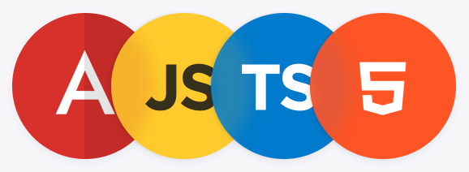
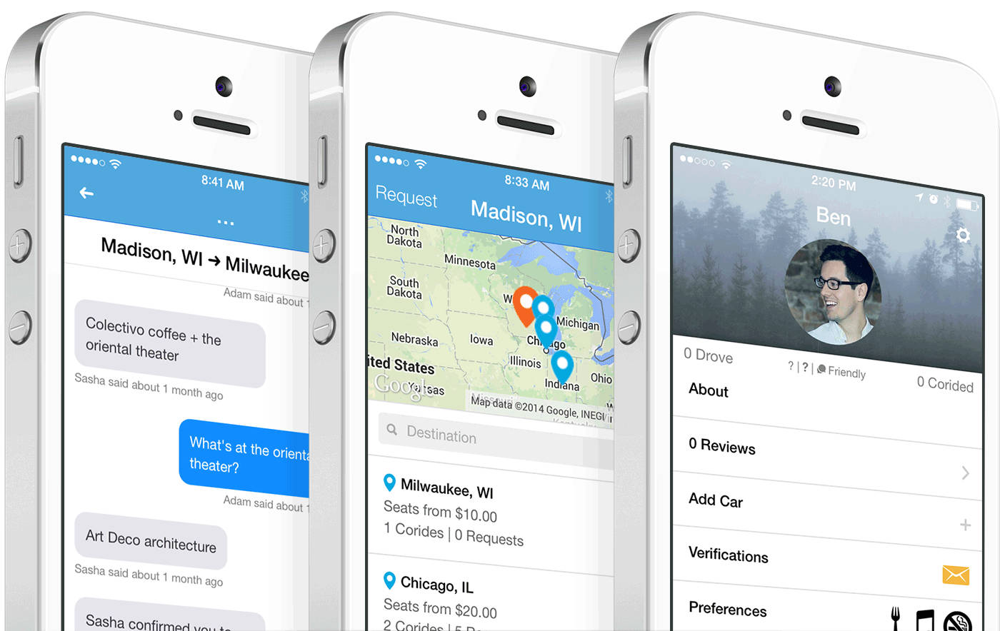
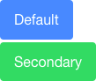
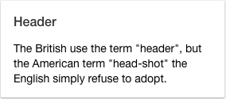
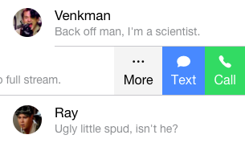

# Ionic

Learn about [Ionic][ionic], an open source framework to build hybrid mobile applications based on [Cordova][cordova] and [Angular][angular].

**You will need**

* [Node.js][node] 8+
* [Google Chrome][chrome] (recommended, any browser with developer tools will do)

**Recommended reading**

* [Angular](../angular/)

<!-- START doctoc generated TOC please keep comment here to allow auto update -->
<!-- DON'T EDIT THIS SECTION, INSTEAD RE-RUN doctoc TO UPDATE -->


- [What is Ionic?](#what-is-ionic)
  - [Which OS should you support?](#which-os-should-you-support)
  - [How can you deal with OS fragmentation?](#how-can-you-deal-with-os-fragmentation)
  - [Cordova](#cordova)
  - [What about Ionic?](#what-about-ionic)
- [Demo](#demo)
  - [Install Ionic](#install-ionic)
  - [Starter templates](#starter-templates)
- [Basics of Ionic](#basics-of-ionic)
  - [Components](#components)
  - [Angular components](#angular-components)
- [Running apps on your mobile device](#running-apps-on-your-mobile-device)
  - [Ionic Dev App](#ionic-dev-app)
- [Resources](#resources)

<!-- END doctoc generated TOC please keep comment here to allow auto update -->


## What is Ionic?

<!-- slide-front-matter class: center, middle, image-header -->

<p class='center'></p>


### Which OS should you support?

<p class='center'></p>


### How can you deal with OS fragmentation?

<p class='center'></p>


### Cordova

<!-- slide-column 30 -->

<p class='center'></p>

<!-- slide-column -->

> "[Cordova][cordova] wraps your **HTML/JavaScript app** into a **native container** which can **access the device functions** of several platforms.
> These functions are exposed via a unified JavaScript API,
> allowing you to easily write one set of code to target nearly every phone or tablet on the market today and publish to their app stores."

<!-- slide-container -->

<p class='center'></p>
<p class='center'>Wait... what?</p>

#### Hybrid mobile applications

<!-- slide-column -->

Write your app with HTML, CSS and JavaScript, **like a website**:


<!-- slide-column 10 -->

<p class='center' style='margin-top:150px;font-size:2em;'><i class='fa fa-arrow-right' aria-hidden='true'></i></p>

<!-- slide-column -->

Embed it into a **native application**:


<!-- slide-container -->

<!-- slide-column 10 -->

<div class='center'>
  <i class='fa fa-camera x2' aria-hidden='true'></i>
  <br />
  <i class='fa fa-location-arrow x2' aria-hidden='true'></i>
  <br />
  <i class='fa fa-arrows-alt x2' aria-hidden='true'></i>
</div>

<!-- slide-column -->

Since you are writing a **web app**, you can access **web APIs** like the [geolocation API][geolocation-api].

But with Cordova, you can also access **device hardware** like the **camera** or the **accelerometer**, and you can do it **in JavaScript**.


### What about Ionic?

<!-- slide-column 35 -->


<!-- slide-column -->

> "Free and open source, Ionic offers a **library of mobile-optimized HTML, CSS and JS components**, gestures, and tools for building highly interactive apps.

> Ionic utilizes **Angular** in order to create a framework most suited to develop rich and robust applications."

<!-- slide-container -->

Ionic is basically **Cordova** and **Angular** plugged together:

<div class='center'>
  
  
</div>

#### What can I do with it?

Ionic lets you build web apps that **look like native apps** with HTML, CSS and JavaScript:

<p class='center'></p>


## Demo

<!-- slide-front-matter class: center, middle, image-header -->

<p class='center'></p>


### Install Ionic

Cordova and Ionic are both **npm packages**.
Install them globally with the following command:

```bash
$> npm install -g cordova ionic
```

You're now ready to use Ionic.
Let's generate an app called `ionic-demo` with the `tabs` starter template:

```bash
$> cd /path/to/projects
$> ionic start ionic-tabs-demo tabs
✔ Creating directory ./ionic-tabs-demo - done!
✔ Downloading and extracting tabs starter - done!
? Would you like to integrate your new app with Cordova
  to target native iOS and Android? Yes
...
? Install the free Ionic Pro SDK and connect your app? No
...
```

Once that's done, run these commands to open the app in your browser:

```bash
$> cd ionic-tabs-demo
$> ionic serve
```


### Starter templates

There are other templates than `tabs`.
For example, this will generate an application with a sliding side menu:

```bash
$> cd /path/to/projects
$> ionic start ionic-sidemenu-demo sidemenu
```

You can also start with a much simpler template.
This will generate an app with just one page and a title,
then it's up to you to define your basic layout:

```bash
$> cd /path/to/projects
$> ionic start ionic-blank-demo blank
```

You will find many Ionic app templates shared by the community in the [Ionic market][ionic-market].


## Basics of Ionic

<!-- slide-front-matter class: center, middle -->


### Components

Ionic has many [UI components][ionic-components] you can use out of the box:

<!-- slide-column 65 -->

```html
<button `ion-button`>Default</button>
<button `ion-button color='secondary'`>
  Secondary
</button>
```

<!-- slide-column -->



<!-- slide-container -->

<!-- slide-column 65 -->

```html
<`ion-card`>
  <`ion-card-header`>
    Header
  </`ion-card-header`>
  <`ion-card-content`>
    The British use the term "header",
    but the American term "head-shot"
    the English simply refuse to adopt.
  </`ion-card-content`>
</`ion-card`>
```

<!-- slide-column -->



<!-- slide-container -->

<!-- slide-column 65 -->

```html
<`ion-range`>
  <`ion-icon` range-left small name="sunny" />
  <`ion-icon` range-right name="sunny" />
</`ion-range`>
```

<!-- slide-column -->


### Angular components

Many of these components are actually [**Angular components**][angular-components].
They not only look pretty, but they also bring **functionality**.
Here's a code example for an Ionic list:

```html
<ion-list>
  <ion-item-sliding `ng-repeat='let person of people'`>
    <ion-item>
      <ion-avatar item-start>
        
      </ion-avatar>
      <h2>`{{ person.name }}`</h2>
      <p>`{{ person.description }}`</p>
    </ion-item>
    <ion-item-options side="left">
      <button ion-button color="primary">
        <ion-icon name="text"></ion-icon>
        Text
      </button>
      <button ion-button color="secondary">
        <ion-icon name="call"></ion-icon>
        Call
      </button>
    </ion-item-options>
  </ion-item-sliding>
</ion-list>
```

#### List component functionality

For example, the list component automatically enables you to [slide in][ionic-sliding-list] controls from the side as most mobile applications do:

<!-- slide-column 65 -->

```html
<ion-item-options>
  <button ion-button color="primary">
    <ion-icon name="text"></ion-icon>
    Text
  </button>
  <button ion-button color="secondary">
    <ion-icon name="call"></ion-icon>
    Call
  </button>
  <button ion-button color="primary">
    <ion-icon name="mail"></ion-icon>
    Email
  </button>
</ion-item-options>
```

<!-- slide-column -->




## Running apps on your mobile device

There are several ways to run your Ionic application on a mobile device.
This section will describe some of them:

* Run on an iOS device (requires a paid Apple developer certificate)
* Run on an Android device
* Run with the Ionic Dev App (Android & iOS)

Follow the setup instructions appropriate for your operating system:

* [macOS setup][ionic-macos-setup]
* [Windows setup][ionic-windows-setup]

Then follow the [deployment instructions][ionic-deploy] (Android & iOS).


### Ionic Dev App

The [Ionic Dev App][ionic-dev-app] is an Android and iOS application in which your own app can run without having to be built and installed on your physically connected device.

To use it, you must serve your app with the `-c` option:

```bash
$> cd /path/to/projects/my-app
$> ionic serve -c
```

If your phone is on the **same network as your computer**,
the Dev App can connect to the mobile application running on your machine.

It may find it automatically, or you may have to manually enter your computer's IP address on some networks.


## Resources

**Documentation**

* [Cordova requirements][cordova-requirements]
* [Ionic][ionic-docs]
  * [Components][ionic-components]
  * [API Documentation][ionic-api-docs]
  * [Developer Resources][ionic-resources]


[angular]: https://angular.io
[angular-components]: https://angular.io/guide/architecture#components
[chrome]: https://www.google.com/chrome/
[cordova]: https://cordova.apache.org
[cordova-requirements]: http://cordova.apache.org/docs/en/latest/guide/platforms/android/index.html
[geolocation-api]: https://developer.mozilla.org/en-US/docs/Web/API/Geolocation/Using_geolocation
[ionic]: http://ionicframework.com
[ionic-account]: https://apps.ionic.io/
[ionic-api-docs]: https://ionicframework.com/docs/api/
[ionic-components]: https://ionicframework.com/docs/components/
[ionic-deploy]: https://ionicframework.com/docs/intro/deploying/
[ionic-dev-app]: https://ionicframework.com/docs/pro/devapp/
[ionic-docs]: https://ionicframework.com/docs/
[ionic-macos-setup]: https://ionicframework.com/docs/developer-resources/platform-setup/mac-setup.html
[ionic-market]: https://market.ionicframework.com/
[ionic-resources]: https://ionicframework.com/docs/developer-resources/
[ionic-sliding-list]: https://ionicframework.com/docs/components/#sliding-list
[ionic-windows-setup]: https://ionicframework.com/docs/developer-resources/platform-setup/windows-setup.html
[node]: https://nodejs.org/en/
