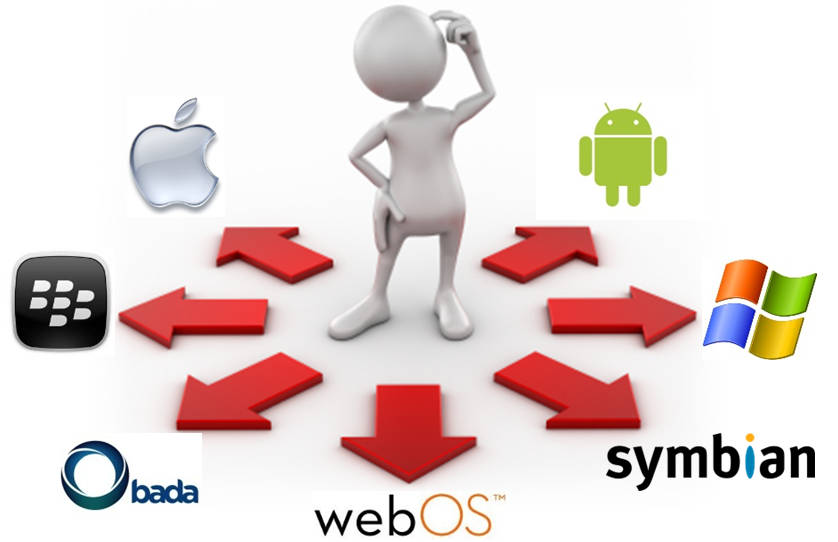
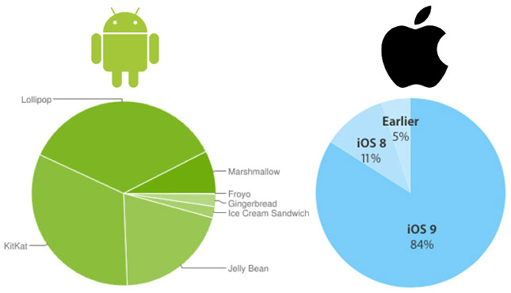
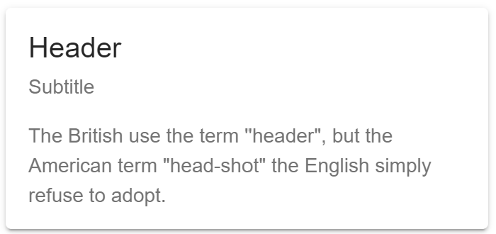

# Ionic

Learn about [Ionic][ionic], an open source framework to build hybrid mobile applications based on [Cordova][cordova] and [Angular][angular].

**You will need**

* [Node.js][node] 10+
* [Google Chrome][chrome] (recommended, any browser with developer tools will do)

**Recommended reading**

* [Angular](../angular/)

<!-- START doctoc generated TOC please keep comment here to allow auto update -->
<!-- DON'T EDIT THIS SECTION, INSTEAD RE-RUN doctoc TO UPDATE -->


- [What is Ionic?](#what-is-ionic)
  - [Which OS should you support?](#which-os-should-you-support)
  - [How can you deal with OS fragmentation?](#how-can-you-deal-with-os-fragmentation)
  - [Cordova](#cordova)
  - [What about Ionic?](#what-about-ionic)
- [Demo](#demo)
  - [Install Ionic](#install-ionic)
  - [Starter templates](#starter-templates)
- [Basics of Ionic](#basics-of-ionic)
  - [Components](#components)
  - [Angular components](#angular-components)
- [Running apps on your mobile device](#running-apps-on-your-mobile-device)
  - [Ionic Dev App](#ionic-dev-app)
- [Resources](#resources)

<!-- END doctoc generated TOC please keep comment here to allow auto update -->


## What is Ionic?

<!-- slide-front-matter class: center, middle, image-header -->

<p class='center'></p>


### Which OS should you support?

<p class='center'></p>


### How can you deal with OS fragmentation?

<p class='center'></p>


### Cordova

<!-- slide-column 30 -->

<p class='center'></p>

<!-- slide-column -->

> "[Cordova][cordova] wraps your **HTML/JavaScript app** into a **native container** which can **access the device functions** of several platforms.
> These functions are exposed via a unified JavaScript API,
> allowing you to easily write one set of code to target nearly every phone or tablet on the market today and publish to their app stores."

<!-- slide-container -->

<p class='center'></p>
<p class='center'>Wait... what?</p>

#### Hybrid mobile applications

<!-- slide-column -->

Write your app with HTML, CSS and JavaScript, **like a website**:


<!-- slide-column 10 -->

<p class='center' style='margin-top:150px;font-size:2em;'><i class='fa fa-arrow-right' aria-hidden='true'></i></p>

<!-- slide-column -->

Embed it into a **native application**:


<!-- slide-container -->

<!-- slide-column 10 -->

<div class='center'>
  <i class='fa fa-camera x2' aria-hidden='true'></i>
  <br />
  <i class='fa fa-location-arrow x2' aria-hidden='true'></i>
  <br />
  <i class='fa fa-arrows-alt x2' aria-hidden='true'></i>
</div>

<!-- slide-column -->

Since you are writing a **web app**, you can access **web APIs** like the [geolocation API][geolocation-api].

But with Cordova, you can also access **device hardware** like the **camera** or the **accelerometer**, and you can do it **in JavaScript**.


### What about Ionic?

<!-- slide-column 35 -->


<!-- slide-column -->

> "Ionic Framework is the free, open source **mobile UI toolkit** for developing high-quality cross-platform apps for native iOS, Android, and the web—all from a single codebase."

<!-- slide-container -->

Ionic is basically **Cordova**, a framework (**Angular**, **Vue**, **React**) and a set of **pre-made web components** plugged together:

<div class='center'>
  
  
</div>

> Please note that we will be using **Angular** as the underlying framework in this course.

#### What can I do with it?

Ionic lets you build web apps that **look like native apps** with HTML, CSS and JavaScript:

<p class='center'></p>


## Demo

<!-- slide-front-matter class: center, middle, image-header -->

<p class='center'></p>


### Install Ionic

Ionic provides you with **CLI tool** that you should install globally with the following command:

```bash
$> npm install -g ionic
```

You're now ready to use Ionic.
Let's generate an app called `ionic-tabs-demo` with the `tabs` starter template:

```bash
$> cd /path/to/projects
$> ionic start ionic-tabs-demo tabs
✔ Preparing directory ./ionic-tabs-demo - done!
✔ Downloading and extracting tabs starter - done!
Installing dependencies may take several minutes.
...
[INFO] Next Steps:
  `- Go to your newly created project: 'cd ./ionic-tabs-demo`
  `- Run 'ionic serve' within the app directory to see your app`
  - Build features and components: `https://ion.link/scaffolding-docs`
  - Get Ionic DevApp for easy device testing: https://ion.link/devapp
```
> Follow the first two infos to see your app in your browser.

> You're also advised to take a look at [the third info's link](https://ion.link/scaffolding-docs)

### Starter templates

There are other templates than `tabs`.
For example, this will generate an application with a sliding side menu:

```bash
$> cd /path/to/projects
$> ionic start ionic-sidemenu-demo sidemenu
```

You can also start with a much simpler template.
This will generate an app with just one page and a title,
then it's up to you to define your basic layout:

```bash
$> cd /path/to/projects
$> ionic start ionic-blank-demo blank
```

You will find many Ionic app templates shared by the community in the [Ionic market][ionic-market].

## Basics of Ionic

<!-- slide-front-matter class: center, middle -->

### Components

Ionic has many [UI components][ionic-components] you can use out of the box:

<!-- slide-column 65 -->

```html
<`ion-button`>Default</ion-button>
<ion-button `color="secondary"`>
  Secondary
</ion-button>
```

<!-- slide-column -->


<!-- slide-container -->

<!-- slide-column 65 -->

```html
<`ion-card`>
  <`ion-card-header`>
    <`ion-card-title`>Header</`ion-card-title`>
    <`ion-card-subtitle`>Sub</`ion-card-subtitle`>
  </`ion-card-header`>

  <`ion-card-content`>
    The British use the term "header",
    but the American term "head-shot"
    the English simply refuse to adopt.
  </`ion-card-content`>
</`ion-card`>
```

<!-- slide-column -->



<!-- slide-container -->

<!-- slide-column 65 -->

```html
<`ion-range`>
  <`ion-icon` slot="start" name="remove"></`ion-icon`>
  <`ion-icon` slot="end" name="add"></`ion-icon`>
</`ion-range`>
```

<!-- slide-column -->


### Angular components

Many of these components are actually [**Angular components**][angular-components].
They not only look pretty, but they also bring **functionality**.
Here's a code example for an Ionic list:

```html
<ion-list>
  <ion-item-sliding `*ngFor='let person of people'`>
    <ion-item>
      <ion-avatar slot="start">
        
      </ion-avatar>
      <ion-label>
        <h2>`{{ person.name }}`</h2>
        <h3>`{{ person.description }}`</h3>
        <p>`{{ person.lastMessage }}`</p>
      </ion-label>
    </ion-item>
    <ion-item-options>
      <ion-item-option>Favorite</ion-item-option>
      <ion-item-option color="danger">Share</ion-item-option>
    </ion-item-options>
  </ion-item-sliding>
</ion-list>
```

#### List component functionality

For example, the `ion-item-sliding` component automatically enables you to [slide in][ionic-sliding-list] controls from the side as most mobile applications do:

<!-- slide-column 65 -->

```html
<ion-item-options>
  <ion-item-option color="primary">
    <ion-icon name="text"></ion-icon>
    Text
  </ion-item-option>
  <ion-item-option color="secondary">
    <ion-icon name="call"></ion-icon>
    Call
  </ion-item-option>
  <ion-item-option color="primary">
    <ion-icon name="mail"></ion-icon>
    Email
  </ion-item-option>
</ion-item-options>
```

<!-- slide-column -->


## Running apps on your mobile device

There are several ways to run your Ionic application on a mobile device.
This section will describe some of them:

* Run with the **Ionic Dev App** (Android & iOS)
* Run on an **iOS device** (Mac users only)
* Run on an **Android device**

Whatever's the method, you'll need to **install Cordova** and **configure your project to use it** with the following commands:

```bash
$> cd /path/to/projects/my-app
$> npm i -g cordova
```

If you want to deploy your app on an Android device

```bash
$> ionic cordova prepare android
```

If you want to deploy your app on an iOS device

```bash
$> ionic cordova prepare ios
```

### Ionic Dev App

The [Ionic Dev App][ionic-dev-app] is an Android and iOS application in which your own app can run without having to be built and installed on your physically connected device.

To use it, you must serve your app with the `--devapp` option:

```bash
$> cd /path/to/projects/my-app
$> ionic serve `--devapp`
```

If your phone is on the **same network as your computer**,
the Dev App can connect to the mobile application running on your machine.

It may find it automatically, or you may have to manually enter your computer's IP address on some networks.

### iOS device

> You can only run on an iOS device from a Mac, since you'll need to install and use Xcode, which is a Mac-only software.
>
> If you don't have a Mac, you'll have to try using the **Ionic Dev App**

First, you'll need to prepare your Mac for deploying to a real or simulated iOS device, by following this instructions page:

[iOS setup][ionic-ios-setup]

Once you're done with those install and setup, you should be able to follow those insctructions:

[Running on iOS][ionic-ios-run]

### Android device

> You can run your app on an Android device from either a Mac or a PC

First, you'll need to prepare your computer for deploying to a real or simulated Android device, by following this instructions page:

[Android setup][ionic-android-setup]

Once you're done with those install and setup, you should be able to follow those insctructions:

[Running on Android][ionic-android-run]

## Resources

**Documentation**

* [Cordova requirements][cordova-requirements]
* [Ionic][ionic-docs]
  * [Components][ionic-components]
  * [API Documentation][ionic-api-docs]
  * [Developer Resources][ionic-resources]

[angular]: https://angular.io
[angular-components]: https://angular.io/guide/architecture#components
[chrome]: https://www.google.com/chrome/
[cordova]: https://cordova.apache.org
[cordova-requirements]: http://cordova.apache.org/docs/en/latest/guide/platforms/android/index.html
[geolocation-api]: https://developer.mozilla.org/en-US/docs/Web/API/Geolocation/Using_geolocation
[ionic]: http://ionicframework.com
[ionic-account]: https://apps.ionic.io/
[ionic-api-docs]: https://ionicframework.com/docs/api/
[ionic-components]: https://ionicframework.com/docs/components/
[ionic-deploy]: https://ionicframework.com/docs/intro/deploying/
[ionic-dev-app]: https://ionicframework.com/docs/appflow/devapp/
[ionic-docs]: https://ionicframework.com/docs/
[ionic-ios-setup]: https://ionicframework.com/docs/installation/ios
[ionic-ios-run]: https://ionicframework.com/docs/building/ios
[ionic-market]: https://market.ionicframework.com/
[ionic-resources]: https://ionicframework.com/docs/developer-resources/
[ionic-sliding-list]: https://ionicframework.com/docs/api/item-sliding
[node]: https://nodejs.org/en/
[ionic-android-setup]: https://ionicframework.com/docs/installation/android
[ionic-android-run]: https://ionicframework.com/docs/building/android
